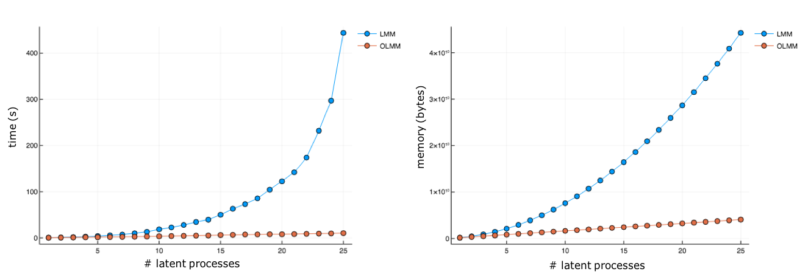
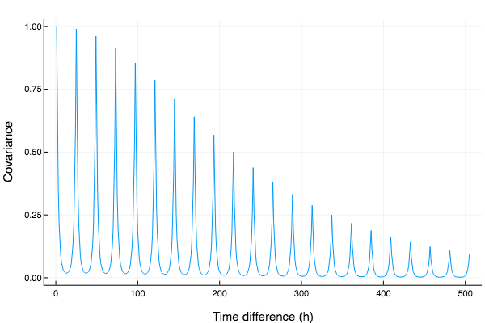

# Notes on our GP models

This note is not intended to be a comprehensive introduction to GPs. For that, refer to
["Gaussian Processes for Machine Learning" by Rasmussen](https://drive.google.com/open?id=1ScVvDzLu4bg13RjeLTBKnrAVxIZdbSNx).
The intention here is to provide a quick overview of the model class we have been exploring.


## Our problem

The main goal of this project is to predict nodal prices (LMPs, MCCs, or MECs) as a
function of time. As a consequence of the Day Ahead Process, we have to make predictions in a 14--38 hour-ahead window.

Ideally, these models will be able to either substitute or be ensembled with the 
ones currently in production (empirical forecaster and PN). For that, a decision engine has to be coupled
with them, since they only produce price forecasts without making mw decisions.

We have been concentrating mostly on predicting ΔLMPs directly, as these are most relevant for 
making our bids. However, these timeseries do not present that much structure, and
we can get better predictions when dealing with DALMPs instead. The downside of this
approach is that it requires some other model capable of accounting for RTLMPs. The current
absence of such model pushes us towards concentrating on ΔLMPs for the time being.

Another possible use of these models is the prediction of MECs, which are currently used
in the process of price formation (i.e. choosing the prices at which we place bids). 
This is a much easier problem, due to having more structure to be exploited and also due 
to being simply a one-dimensional problem. Once we have a better understanding of fees 
incurred in by being unbalanced (and are able to estimate them beforehand), good MEC 
predictions also open the possibility of new strategies in which we are intentionally 
unbalanced. So far, we have been neglecting MECs, as they are of less immediate impact to us.


## GPs

GPs are just one of the many possible regression methods available. One of the
main advantages is that they provide calibrated uncertainties, which are important when
making mw decisions. Moreover, they are easy to use and provide us with ways of leveraging problem-specific knowledge.

## Main challenges

- Ideally, the entire process, from fetching data, to training the model, making the predictions and building the portfolio, should take less than 1h. This guarantees that we have access to all of the most recent data before running the model. For every extra hour that the process takes, we have to start everything earlier and thus lose one entire timestamp from the data.

- GPs are inherently expensive, so dealing with systems as large as MISO is not easy. For instance, the full covariance matrix for all MISO nodes during a 24h period is of the order of 50k x 50k.

- ΔLMPs are very spiky and present very rapidly decaying auto-correlation. That means we have little structure to exploit and that it is harder to work with smooth functions.

- We have multiple sources of non-stationarities. Among them we can cite the fact that the grid itself physically changes over time (through addition of new generators and transmission lines, retirement of old generators, maintenance, etc.), that weather conditions change throughout the year, that grid behaviour on certain features---such as load---is naturally non-stationary, etc. Since most kernels used for GPs are stationary, this can limit our descriptive power.


# Our model

There are several multi-output GP (MOGP) models in the literature. However, as we deal with 
large systems and can't train for too long, we opt for one of the simplest (and cheapest) possible. 
The basic idea is that the sample covariance for observed prices present a low-rank structure, 
meaning that, while the matrix is large, its columns/lines lie in a low dimensional space 
(in practice, the sample covariance matrix we compute is only approximately low rank, i.e., it is full 
rank, but several of the eigenvalues are negligible). Intuitively, this means that there 
are only a few processes which determine the behaviour of the entire system. 
We call these the latent process (latent because they are not directly observed).

## LMM

The simplest/cheapest way one can model prices using latent processes is with a linear combination. 
In practice, that can be achieved by organising the latent processes in a vector and computing the product with a matrix, as in `y = H * x`.

If we model all latent processes `x` as GPs, it follows that the prices `y` will also 
be a GP, since GPs are closed under linear combinations. The matrix `H` is called 
the mixing matrix. This is the gist of what we call the linear mixing model (LMM). 
For more details on this, see [GPLMM.pdf](https://drive.google.com/open?id=1xo4OvPZmIV7jvs66YRXRqml__BScaAgd).

A crucial choice in this type of model is the number of latent processes. 
The higher the number, the larger the basis set in which the predictions are defined. 
In principle, one could even choose to have more latent processes than there are outputs. 
The only limiting factor in this choice is the computational cost, which scales with this number.

## OLMM

Despite being remarkably cheap for a MOGP model, the LMM can still be very 
expensive for large systems. In order to mitigate computational costs, 
we have developed what we call the orthogonal linear mixing model (OLMM). 
This model is remarkably similar to the LMM, with the main difference coming 
from a restriction over `H`. In the OLMM, we constrain the mixing matrix to 
be of the form `H = U * S^(1/2)`, with `U` orthogonal (i.e. `U'U = I`) and
`S` diagonal. This simple consideration brings several ramifications that are 
discussed at length in [Wessel's 1st year report](https://drive.google.com/open?id=1QC0yA2AfzhMGYUvL_cksmVklRJ3nMhUh). 
Most notably, this greatly decreases the computational cost. 
A benchmark using GPForecasting.jl can be seen in the figure below.



In practice, the OLMM allows us to use a much larger number of latent processes. 
Also, it is simpler to combine with other methods such as the sparse GPs (discussed below). 
Thus, we have been concentrating most efforts on the OLMM, even though we have not completely given up on the LMM.

The OLMM presents an important restriction in that the number of latent processes 
can never be larger than the dimensionality of the output space (otherwise it is 
impossible have an orthogonal basis). However, only for the smaller grids we are 
able to utilise a number of latent processes that is comparable with the number of nodes.

## An interpretation for `H` and `x`

One possible interpretation for this model is that the latent processes, `x`, 
pose as a proxy to shadow prices, while the mixing matrix, `H`, represents a proxy 
to the shift factor matrix (or PTDF) of the system. For more details on this, 
including implementation details etc., see [GPLMM Inveniacon slides](https://drive.google.com/open?id=12hCC4y_n8HqDAErls_8XieutCTj81j9v).

In practice, the mixing matrix defines the latent processes that we are trying to 
learn (by projecting the observed data into a latent space). This highlights the 
importance of having sensible values for `H`. In case we utilise a poorly chosen `H` 
we might end up with latent processes that exhibit very little structure and thus are harder to learn.

## Initialising `H`

Currently we are still using fixed values for `H`. This should change very soon, 
but, even then, it is important to have a sensible initialisation for this matrix. 
Our current approach to doing that is building the sample covariance matrix 
(using the [Ledoit-Wolf method](https://drive.google.com/open?id=1tmqLh2yC6wl2KBsklevQVvWaeEUNAkia), 
in order to obtain a better conditioned result), taking a single value decomposition 
and only keeping the `m` eigenvectors with higher eigenvalues (in the case of the 
OLMM, we also enforce the orthogonality). This is equivalent to PCA.

The quality of the sample covariance is very strongly dependent on the amount of data. 
Even when adopting an improved method for this task, such as the Ledoit-Wolf method, 
we still want to have a considerably large data set. With this in mind, we usually use a 
considerably larger training window for computing this covariance. While computational cost 
usually limits us to about 3 weeks of data for training the GPs, it is perfectly feasible 
to use 45, or even 90, days for constructing the covariance. Caution must be taken with excessively 
long periods, however, since, as we mentioned before, there are several sources of 
non-stationarity in the system (experiments suggest that 30-45 days is a sensible choice).

We might have performance gains with better initialisation (maybe some form of ICA could help), 
but, likely, the best results will be obtained when executing continuous optimisation.

## Kernel design

Choosing the kernel is possibly the most important step in working with GPs. 
While it is easy to achieve good interpolation with uninformed kernel choices, 
extrapolation can be tricky, especially in our case, in which predictions are made 
after a 24h gap from the training data. At first, we adopted kernels based on the 
observation of the auto-correlation of the DALMP timeseries. However, those did not 
translate too well for the ΔLMP case (likely because of less structure in its auto-correlation).

The time kernel we currently adopt is heavily inspired in the EmpiricalForecaster, 
constituted by two kernels which are multiplied. The first one is a Matèrn 1/2 kernel 
that is made periodic with a 24h period. Since the Matèrn presents an extremely 
short correlation, that each hour correlates mostly only with their equivalent 
in previous days (with some weaker correlation between neighbouring hours). 
The second term is a rational quadratic kernel. By multiplying the first kernel by 
this one, we make it such that the correlation between hours `h` of different days 
decays with the number of days separating them. Below we have a plot of this kernel 
as a function of the delta in hours.



We have also had some limited success adding an analogous term that accounts for 
the correlation between days `d` belonging to different weeks. In practice, we have 
the same kernel with different parameters (most importantly the periodicity, which goes from 24h to 1 week).

Besides time, we have tested using load, capacity on outage, temperature and others as features. 
Usually, these are tested with very simple kernels, such as EQs. However, we have yet to obtain significant gains here.

## Experiments

We have yet to be able to run robust backruns using GPs. So far, our experiments 
have consisted of predicting prices and comparing the predictions with the historical prices. 
This is only intended to serve as the initial step of the model design, 
in which we make the coarser adjustments, before resorting to the more expensive backruns for fine tuning.

In order to avoid unintentional overfitting, we only work with restricted datasets 
(currently for MISO and for PJM) which are hosted by ModelAnalysis.jl. 
This way, we can still trust that the results of long backruns are not (too) biased.

Experiments consist on slicing the data in consecutive windows, which define a training 
set containing hours `0` to `h` and a testing set containing hours `h + 24` to `h + 48`. 
After each prediction task, the window is rolled forward by 24h, i.e. the task is repeated for the following day.

Performance in these tasks is measured usually via two metrics: MSE and MLL. 
MSE stands for _mean squared error_ and is exactly what the name says. 
MLL stands for _mean log loss_ and consists of computing the logarithm of the 
probability density function of the test values given the predictive distribution, 
all under a Gaussian likelihood. Pragmatically, that means obtaining the first two 
moments of the predictive distribution, using that to define a normal distribution 
(which, in the case of GPs, coincides with the predictive distribution) and computing 
the logarithm of the probability of the test data under that distribution.

Although MSE is one of the most widely adopted metrics, it does not account for uncertainty. 
As such, it ignores an important part of our predictions (and we have seen in the 
past models that had very good MSE can present poor financial returns). 
For that reason, we tend to believe the MLL is more informative. 
One possible criticism towards the adoption of the MLL is that it assumes a 
Gaussian likelihood for the data. However, the current decision engine (Markowitz) 
only takes into account the first two moments of the predictive distribution, 
which effectively means that it reduces the predictive distribution to a Gaussian. 
Thus, the MLL seems like an adequate metric and is the one in which we usually 
focus more, but *it is important to keep in mind that we do not know how well good MLL translates into high financial returns*. 
For this reason, backruns are so important.

We have also implemented a couple of other metrics in ModelAnalysis.jl, such as 
the _prediction interval coverage probability_ (PICP) and related. However, we haven't really looked into these yet.

Once we are able to routinely run backruns, we should start looking at financial 
metrics, such as median return, evano and expected shortfall. Naturally, this requires 
feeding the predictive distributions for the prices into some decision engine 
(either Markowitz or ESPO) in order to generate a portfolio. 
Nevertheless, this is the final test to judge if the model is adequate or not for our prod system.

## New model features

### Neural Kernel Networks

As already mentioned, designing kernels is an important part of doing GP regression. 
While one can adopt the approach of using heuristics for this task, for very complex 
data it might be more efficient to use some form of data-driven, automatic, kernel design.

One such method is the neural kernel networks (NKN). The idea is that, since products 
and linear combinations of valid kernels are also valid, one can create a network 
in which each layer does either of those operations. The advantage here is that is 
this entire process can be differentiable, which allows us to run gradient descent 
(currently we optimise the log-likelihood of the training data under the prior) 
and at once optimise all kernel parameters as well as the kernel shape.

There are, of course, important choices when building this method, mainly the 
network topology (number, type and size of layers) and the base kernels, meaning that this is not completely brain-off.

As for the usage in the package, there is no change from the usual workflow, 
except for the definition of the network. Here's a simple example:
```julia
true_k = 0.5 * EQ() + periodicise(EQ(), 1.0)
true_gp = GP(true_k)
x = collect(0:0.01:8);
y = sample(true_gp(x));

base_kernels = [1.0 * EQ(), 1.0 * periodicise(EQ(), 1.3), 1.0 * ConstantKernel(), 1.0 * DotKernel()]
configuration = Fixed([:L, :P, :L])
PL = Bool[1 1 1 1 1 1 1 1; 1 1 0 0 0 0 0 0; 0 1 0 1 0 1 0 1; 1 0 1 0 1 0 1 0]
coeffs = (Positive((1/32) .* rand(0:0.01:1, 8, 4)), Fixed(PL), Positive(0.25 .* rand(0:0.01:1, 1, 4)))
nkn = NKN(base_kernels, Fixed(3), configuration, coeffs)
gp = GP(nkn)
ngp = learn(gp, x, y, objective, its=500)
```

The snippet above, while able to very nicely recover the shape of the covariance, 
fails to capture the right variance. It is still not clear as to why this happens. 
For more on it, see [the MR](https://gitlab.invenia.ca/research/GPForecasting.jl/merge_requests/77).

Even if we get this method to work fine, we very likely don't want to use NKNs in 
the day-to-day operations. Instead, it would make sense to run one very long 
training job, in order to obtain a good kernel, and then simply use that one in the daily training process.

For proper details on the method, refer to the [original paper](https://drive.google.com/open?id=1-8x-HqiNyRDzLiejK2ASr7R42-mdUXVB).

### HazardKernel

If we look at our historical returns, we see that there are some unusual days in 
which we have very pronounced losses. Empirically, we have verified that, at least in some cases, 
these stem from critical weather conditions (hurricanes, floods, snow storms...). 
_Ad hoc_ approaches to dealing with this (mainly deciding not to bid) have been 
attempted in the past, with unsatisfactory results (if curious, ask Coz about the Batman event). 
That is why we'd like to have some principled way of dealing with extreme conditions.

One possible dataset that can be leveraged for this end, is the hazards one. 
It consists on a categorical dataset with alerts about extreme conditions (such as `heat wave warning`). 
The dataset is highly granular in geography and provides predictions for the next few days.

An important thing to notice about this dataset is that hazards are very sparse in time. 
Thus, we should not expect to have enough data from a given hazard in the past to make future predictions with it.

The idea behind the `HazardKernel` is that, while we cannot have enough past 
information about extreme days to extrapolate in the future, we can at least make 
it such that we do not correlate regular days with extreme ones. This is achieved 
by pre-multiplying our main kernel with another one that equal `1` for regular days, 
but that decreases drastically whenever we compare regular days and extreme days. 
In practice, it means that the model is unable to establish correlations and 
automatically reverts to the prior, yielding higher uncertainty.

This is a principled approach in that this is just another valid kernel, which 
can be trained like any other and does not require _ad hoc_ decisions. In fact, 
it does not make decisions, as that's the role of the decision engine, only passing forward a better calibrated uncertainty.

A more detailed explanation on how to use this kernel and its effects can be seen 
in the [original MR](https://gitlab.invenia.ca/research/GPForecasting.jl/merge_requests/32).

Challenges here are mostly due to the very high geographical granularity of the 
data and to the very large number of different hazards.

### Sparse GPs

GPs are memory hungry and our systems are large. Thus, we end up being forced to 
use less training data than we'd like to. Currently, we use 3 weeks (504 hours) of 
training data, which is less than ideal. In order to be able to use more data, 
but without having to come up with any timestamp selection heuristics, we adopt the textbook approach of sparse GPs.

What this approach does is create a distribution that summarises a large dataset 
and outputs a smaller one (which are called the inducing points). The GP is then 
trained on this smaller dataset. The entire system is trained jointly, i.e., the GP 
and the distribution that summarises the data, which requires the use of variational inference. 
Luckily, this problem has already been solved and is easy to implement. 
For details, see [the original paper](https://drive.google.com/open?id=1CYhu3_hky4ShLQVSJFgm8PLYBUle2dGz).

The main choices when using this method are the size of the training data and 
the number of inducing points. The location of the inducing points can be optimised 
(can also be held fixed if so desired), meaning that very little complexity is 
added on top of the usual model. One possible issue here is that the ΔLMP timeseries 
is very peaky, thus sparsing out the input points may be less than ideal. 
However, we can hope that the optimal distribution of the inducing points is able to capture this.

This approach is fully compatible with the OLMM. However, extra work is needed in order to make it work with the LMM.

As of [this MR](https://gitlab.invenia.ca/research/GPForecasting.jl/merge_requests/87), 
sparse posteriors will use `Input`-typed inputs, in order to control when to add 
observation noise (for more details on this, see [our documentation](https://research.pages.invenia.ca/GPForecasting.jl/EIS/)).

### ManifoldGPs

All that ManifoldGPs (mGPs) do is learn a pre-transformation of the data such that 
the GP can be trained in the transformed input. In this sense, it is not really 
different from doing something as simple as running, say, PCA on the inputs before 
carrying on with the model regression. The two main differences here are that mGPs 
learn the transformation and the GP jointly, meaning that the transformation is 
learned in a supervised way (as opposed to PCA, for instance), and that the allowed 
transformations are very flexible. This is all possible due to the transformations being parametrised by a neural network.

The advantage of using NNs here is that they can be arbitrarily flexible and they 
are trivial to differentiate through, while having the GPs on top of it allows us 
to leverage the usual GP properties. The main disadvantage is also the flexibility, 
as it introduces a lot of extra complexity in the model (making it harder to get to work and easier to overfit).

In the best case scenario, we can hope that mGPs are able to deal with large 
dimensional input datasets, learn non-stationarities and deal with the roughness 
of the timeseries. Realistically, this will be difficult to get to work reliably.

On the practical side, `ManifoldKernel` is a kernel that wraps a NN and another kernel. 
Whenever it's called, it first perform the input transformation, by calling the NN 
over the inputs, and the computes the wrapped kernel over the transformed inputs. 
With this, there is no change whatsoever to the usual workflow, except for the definition of the NN.

We have built our own minimal NN interface, as we should not need anything too 
fancy for our NNs (in order to mitigate model complexity) and we need to make
everything Nabla-compatible, in order to perform the optimisation in a single pipeline. 
In the utopic future in which we have a single AD framework for Julia, we 
can build this on top of Flux or something else fancier.

A very simple usage example:
```julia
# Generate data for noisy step function
y = vcat(1e-2 * randn(50), ones(50) + 1e-2 * randn(50));
x = Observed(collect(-0.49:0.01:0.5));
xt = Latent(collect(-0.99:0.01:1));

# First, treat the problem as a regular GP
k = NoiseKernel(1.0 * stretch(EQ(), Positive(1.0)), Fixed(1e-2) * DiagonalKernel())
gp = GP(k)
ngp = learn(gp, x, y, objective, its=500)
pos = condition(ngp, x, y)

# Second, do the same as a ManifoldGP
k = NoiseKernel(1.0 * stretch(EQ(), Positive([1.0, 1.0])), Fixed(1e-2) * DiagonalKernel())
# Create neural net
activation = sigmoid
l1 = NNLayer(randn(6, 1), 1e-2 .* randn(6), Fixed(activation))
l2 = NNLayer(randn(2, 6), 1e-2 .* randn(2), Fixed(activation))
nn = GPFNN([l1, l2])
# Pass to ManifoldKernel
mk = GPForecasting.ManifoldKernel(k, nn)
#Do the usual stuff
mgp = GP(mk)
nmgp = learn(mgp, x, y, objective, its=500)
mpos = condition(nmgp, x, y)
```

For proper details on the model, see [the original paper](https://drive.google.com/open?id=1C83GUJ40uN1j5vPbB0dsPNIQyrx0BqJ_).
