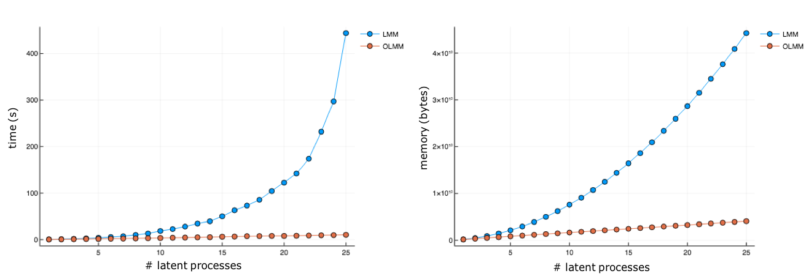

# GP Models

GPs are just one of many possible regression methods available.
One of the main advantages is that they provide estimates of prediction uncertainty, which are important when making decisions.
Moreover they are easy to use, and provide ways of leveraging problem-specific knowledge.

## Challenges for GPs

- GPs are inherently expensive relative to e.g. linear models due to the need to store and factorise matrices that scale with the dimensionality of the dataset, so dealing with large systems (large numbers of outputs and/or large numbers of training data points) is not easy.
- GPs work well for problems with structure to exploit and where it is desirable to work with smooth functions.

## Multi-output GPs

There are several multi-output GP (MOGP) models in the literature.

A simple and cheap model assumes that the sample covariance of outputs has a low-rank structure, meaning that while the matrix is large its columns lie in a low dimensional space.
In practice, the covariance matrix we compute is only approximately low rank, i.e. it is full rank but several of the eigenvalues are negligible.
Intuitively, this means that there are only a few processes which determine the behaviour of the entire system.
We call these the [latent processes](https://en.wikipedia.org/wiki/Latent_variable) (latent because they are not directly observed).

## Linear Mixing Model (LMM)

The simplest and cheapest way one can model multiple outputs using latent processes is with a linear combination.
In practice, that can be achieved by organising the latent processes in a vector and computing the product with a matrix, as in ``y = H f + \epsilon``.

If we model all latent processes ``f`` as GPs, it follows that the output variables ``y`` will also be GPs, since GPs are closed under linear combinations.
The matrix ``H`` is called the mixing matrix and is comprised of weight parameters ``h_ij`` that can be learned during model optimisation.
This is the gist of what we call the linear mixing model (LMM).
For more details on this, see the [Kernel Instantaneous Linear Mixing Model](https://drive.google.com/open?id=1xo4OvPZmIV7jvs66YRXRqml__BScaAgd).

A crucial choice in this type of model is the number of latent processes.
The higher the number, the larger the basis set in which the predictions are defined.
In principle, one could even choose to have more latent processes than there are outputs.
The only limiting factor in this choice is the computational cost, which scales with the number of latent processes.

## Orthogonal Linear Mixing Model (OLMM)

Despite being remarkably cheap for a MOGP model, the LMM can still be very expensive for large systems.
In order to mitigate computational costs, we have developed what we call the orthogonal linear mixing model (OLMM).

The OLMM model is remarkably similar to the LMM, with the main difference coming from a restriction over ``H``.
In the OLMM, we constrain the mixing matrix to be of the form ``H = U * S^{\frac{1}{2}}``, with ``U`` orthogonal i.e. ``U^{\top} U = I`` and ``S`` diagonal.
This simple consideration brings several ramifications that are discussed at length in [Wessel's 1st year report](https://drive.google.com/open?id=1QC0yA2AfzhMGYUvL_cksmVklRJ3nMhUh).
Most notably, this greatly decreases the computational cost.

A benchmark using GPForecasting.jl can be seen in the figure below.



In practice, the OLMM allows using a much larger number of latent processes and scaling models to a much larger number of outputs.
Also it is simpler to combine with other methods such as the [Sparse GPs](@ref).

The OLMM presents an important restriction: the number of latent processes can never be larger than the dimensionality of the output space, since otherwise it is impossible have an orthogonal basis.

Another restriction is that all outputs must have the same observation noise variance i.e. ``\Sigma = \sigma^2 I``


### Initialising ``H``

The mixing matrix ``H`` defines the latent processes that we are trying to learn; it is projecting the observed data into a latent space.
This highlights the importance of having sensible values for ``H``.
In case we utilise a poorly chosen ``H`` we might end up with latent processes that exhibit very little structure and thus are harder to learn.

It is important to have a sensible initialisation for this matrix.
One approach to doing that is building the sample covariance matrix using the [Ledoit-Wolf method](https://jpm.pm-research.com/content/30/4/110) in order to obtain a better conditioned result, then taking a singular value decomposition and only keeping the ``m`` eigenvectors with the highest eigenvalues, and in the case of the OLMM we also enforce the orthogonality.
This is equivalent to PCA.

The quality of the sample covariance is very strongly dependent on the amount of data.
Even when adopting an improved method for this task, such as the [Ledoit-Wolf method](https://jpm.pm-research.com/content/30/4/110), we still want to have a considerably large data set.

## Grouped OLMM (GOLMM)

The GOLMM kernel was initially proposed to impose some regularisation on the mixing matrix to support a richer, and possibly higher rank, latent function structure.
A richer structure might be desirable where there is, for example, heterogeneity across tasks and some kind of sub-populations present, but where without some structure on ``H`` the model is prone to overfitting.

The final form of the “multi-kernel” captures grouping structure between nodes in a separable kernel by incorporating grouping structure in the mixing matrix ``H``.

For each of the output time-series ``i \in \{1 \ldots p \}``, let us introduce a learnable _group embedding_ ``h_i \in \reals^\ell``, where ``\ell \geq 1``).
These embeddings can be thought of as coordinates of that time-series in some space where similar series are located close by.

To express this mathematically, we define a _group kernel_ ``k_\theta: \reals^\ell, \reals^\ell \rightarrow \reals``, ``\theta`` being learnable hyperparameters, which we apply to the group embeddings ``h_{i = 1}^p`` to construct a covariance matrix for the outputs:
```math
\mathbf{K} =
    \begin{bmatrix}
        k(h_1, h_1) & \cdots & k(h_1, h_p) \\
        \vdots & \ddots & \vdots \\
        k(h_p, h_1) & \cdots & k(h_p, h_p) \\
    \end{bmatrix}
```

Now, we perform [eigendecomposition](https://en.wikipedia.org/wiki/Eigendecomposition_of_a_matrix) of this matrix:
```math
K = U S U^{\top}
```
and define the mixing matrix ``H`` using the ``m`` dominant eigenvectors
```math
H = U_{1 \ldots m, 1 \ldots m} ~ S_{1 \ldots m, 1 \ldots m}
```
which by construction are orthogonal, and hence compatible with the OLMM.

Intuitively, the above procedure can be understood as kernelised PCA in the learnable ``h``-space of group embeddings.

The current implementation of [`GOLMMKernel`](@ref) uses ``h \in \reals``.

## Neural Kernel Networks (NKN)

Designing kernels is an important part of doing GP regression.
For very complex data it might be useful to use some form of data-driven, automatic, kernel design.
One such method is the neural kernel network.

The NKN idea is that, since products and linear combinations of valid kernels are also valid, one can create a network in which each layer does either of those operations.
The advantage here is that is this entire process can be differentiable, which allows us to
use gradient-based optimisation.
The current implementation optimises all kernel hyperparameters as well as network architecture simultaneously.
Architecture is optimised by having weight coefficients that determine the importance of different components of the network.
In essence, the NKN is an overspecified, flexible sum-product kernel combination that "self-selects" the important components by optimisation of weights and hyperparameters.

There are, of course, important choices when building this method, mainly the network topology (number, type and size of layers) and the base kernels, meaning that this is not completely without design.

As for the usage in the package, there is no change from the usual workflow, except for the definition of the network.

Here's a simple example:
```julia
true_k = 0.5 * EQ() + periodicise(EQ(), 1.0);
true_gp = GP(true_k);

x = collect(0:0.01:8);
y = sample(true_gp(x));

base_kernels = [
    1.0 * EQ(),
    1.0 * periodicise(EQ(), 1.3),
    1.0 * ConstantKernel(),
    1.0 * DotKernel()
];


configuration = Fixed([:L, :P, :L]);
PL = Bool[
    1 1 1 1 1 1 1 1
    1 1 0 0 0 0 0 0
    0 1 0 1 0 1 0 1
    1 0 1 0 1 0 1 0
];
coeffs = (
    Positive((1/32) .* rand(0:0.01:1, 8, 4)),
    Fixed(PL),
    Positive(0.25 .* rand(0:0.01:1, 1, 4)),
)

nkn = NKN(base_kernels, Fixed(3), configuration, coeffs)
gp = GP(nkn)
ngp = learn(gp, x, y, objective, its=500)
```

The snippet above, while able to very nicely recover the shape of the covariance, fails to capture the right variance.
It is still not clear as to why this happens.
For more on it, see [the MR](https://gitlab.invenia.ca/invenia/GPForecasting.jl/merge_requests/77).

Even if we get this method to work fine, we very likely don't want to use NKNs in the day-to-day operations.
Instead, it would make sense to run one very long training job, in order to obtain a good kernel, and then simply use that one in the daily training process.

For proper details on the method, refer to the paper [Differentiable Compositional Kernel Learning for Gaussian Processes](https://arxiv.org/abs/1806.04326).

## Hazard Kernel

The [`HazardKernel`](@ref) is designed as a principled way to deal with "extreme" data points that do not correlate with "regular data points.

Suppose that you know your dataset contains extreme outliers, that you still want to be able to deal with.
Suppose we know we with not have enough past information about extreme data points to extrapolate into the future.
We can at least make it such that we do not correlate regular data with extreme data.

This is achieved by pre-multiplying our main kernel with another one that equals ``1`` for regular days, but that decreases drastically whenever we compare regular data and extreme data.
In practice, it means that the model is unable to establish correlations and automatically reverts to the prior, yielding higher uncertainty.

This is a principled approach in that this is just another valid kernel, which can be trained like any other and does not require _ad hoc_ intervention.

A more detailed explanation on how to use this kernel and its effects can be seen in the [original MR](https://gitlab.invenia.ca/invenia/GPForecasting.jl/merge_requests/32).

## Sparse GPs

GPs are memory hungry.
This pushes towards using less training data than one may like.
In order to be able to use more data, but without having to come up with any ad hoc selection heuristics, one can adop the approach of sparse GPs.

Spares GPs create a distribution that summarises a large dataset and outputs a smaller one comprised of "inducing points".
The GP is then trained on this smaller dataset.

The entire system is trained jointly; the GP and the distribution that summarises the data.
To do this we use an analytical form of variational inference that is available when ``y|f`` is normally distributed.
For details, see the paper [Variational Learning of Inducing Variables in Sparse Gaussian Processes](http://proceedings.mlr.press/v5/titsias09a.html).

The main choices when using this method are the size of the training data and the number of inducing points.
The location of the inducing points can be optimised (or held fixed), meaning that very little complexity is added on top of the usual model.

This approach is fully compatible with the OLMM.
However, extra work is needed in order to make it work with the LMM.

For details on adding observation noise, see the documentation on [Noisy Observations and Extended Input Space](@ref)

## Manifold GPs

All that Manifold GPs do is learn a pre-transformation of the data such that the GP can be trained in the transformed input.
In this sense, it is not unlike simply running PCA on the inputs before carrying on with the model regression.
There are, however, two important differences from simple dimensionality reduction techniques like PCA.
Firstly, in Manifold GPs the pre-transformation and the GP hyperparameters are learnt _jointly_ in a _supervised_ way, which encourages the learnt feature representations to be useful for the GP regression problem at hand.
For example, we may hope for the learnt feature space to be somewhat smooth, as desired for GPs.
Secondly, the pre-transformation is not required to be linear, and can in principle be any differentiable function.
For example, in our implementation we use a feed-forward neural network.

The advantage of using neural networks here is that they can be arbitrarily flexible and they are trivial to differentiate through, while having the GPs on top of it allows us
to leverage the usual GP properties.
The main disadvantage is also the flexibility, as it introduces extra complexity to the model, thus making it less interpretable, more dependent on initialisation and more prone to overfitting.

In the best case scenario, we can hope that Manifold GPs are able to alleviate the "curse-of-dimensionality" in the case of high-dimensional inputs, handle non-stationarities and learn feature spaces that are smooth with respect to the dependent variable.
Realistically, this will be difficult to get to work reliably.

On the practical side, [`ManifoldKernel`](@ref) is a kernel that wraps a neural network and another kernel.
Whenever it is called, it first performs the input transformation by calling the neural network over the inputs, and then computes the wrapped kernel over the transformed inputs.
With this, there is no change whatsoever to the usual workflow, except for the definition of the neural network.

We have built our own minimal neural network interface, as we should not need anything too fancy for our networks, in order to mitigate model complexity, and we need to make sure everything compatible with our automatic differentiation system, in order to perform the optimisation in a single pipeline.
In the future, when using Zygote.jl for reverse-mode automatic differentiation, we can build this on top of Flux.jl or another neural network package.

A very simple usage example:
```julia
# Generate data for noisy step function
y = [1e-2 * randn(50); ones(50) + 1e-2 * randn(50)]
x = Observed(collect(-0.49:0.01:0.5));
xt = Latent(collect(-0.99:0.01:1));
```
First, treat the problem as a regular GP
```julia
k = NoiseKernel(
    1.0 * stretch(EQ(), Positive(1.0)),  # true
    Fixed(1e-2) * DiagonalKernel()       # noise
);

gp = GP(k);

ngp = learn(gp, x, y, mle_obj; its=500);
pos = condition(ngp, x, y)
```

The same as above using a [`ManifoldKernel`](@ref):
```julia
# Create neural network
l1 = NNLayer(randn(6, 1), 1e-2 .* randn(6), Fixed(sigmoid));
l2 = NNLayer(randn(2, 6), 1e-2 .* randn(2), Fixed(identity));
nn = GPFNN([l1, l2]);

mk = ManifoldKernel(k, nn);
mgp = GP(mk);

nmgp = learn(mgp, x, y, mle_obj; its=500);
mpos = condition(nmgp, x, y)
```

For proper details on Manifold GPs, see the paper [Manifold Gaussian Processes for Regression](https://arxiv.org/abs/1402.5876).
